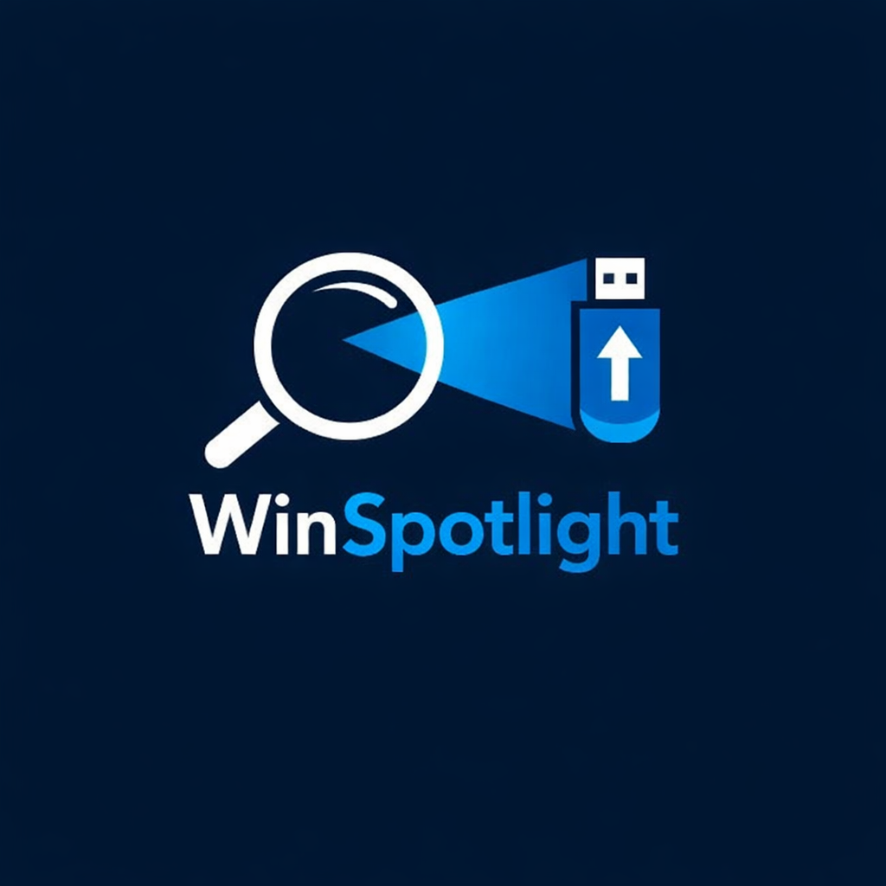
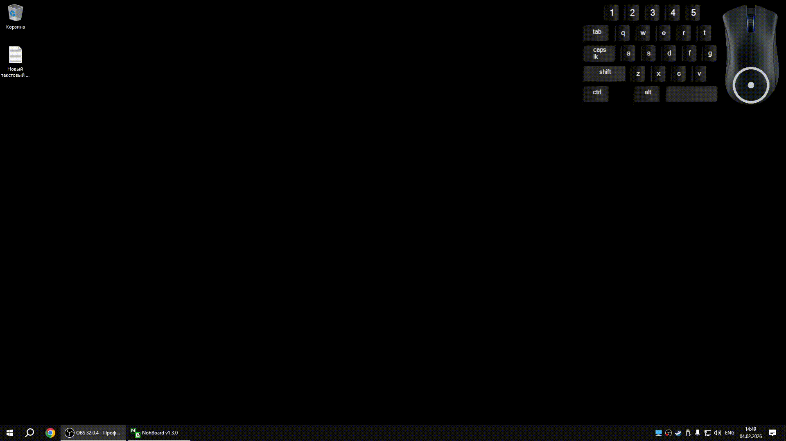

<h1 align="center">
    <br>
    
    <br>
    WinSpotlight
    <br>
</h1>

<p align="center">
    <a href="#основные-возможности">Features</a> •
    <a href="#установка">Installation</a> •
    <a href="#исползование">Usage</a> •
    <a href="#поддержка">Support</a>
</p>

## Основные возможности

* Вызов режима зума, если содержимое экрана плохо различимо
* Безопасное извлечение флешки / флешек по нажатию хоткея

## Установка

### Способ 1: Запуск из исходников

```bash
# Клонирование этого репозитория
$ git clone https://github.com/readocdev/WinSpotlight

# Переходим в папку репозитория
$ cd WinSpotlight

# Ставим зависимости проекта
$ pip install -r requirements.txt

# Запускаем приложение
$ python main.py
```

### Способ 2: Сборка .exe файла

```bash
# Ставим pyinstaller
$ pip install pyinstaller

# Запускаем файл build.py
$ python build.py

# Заходим в папку dist и запускаем exe
$ dist/WinSpotlight.exe
```

### Сопособ 3: Запуск проект через консоль

```bash
# Достаточно дважды кликнуть по файлу
$ start.cmd
```

## Использование

После запуска приложение работает в фоновом режиме и отображается в системном трее Windows.

Настройка и управление приложением выполняются через контекстное меню, доступное по нажатию **правой кнопки мыши** на иконке в трее.

### Горячие клавиши

- **Alt + Z** - включение режима увелечения.
- **Alt + E** - безопасное извлечение USB-устройств.

### Демонстрация

<p align="center">
    
</p>


## Поддержка

Если вы нашли баг или хотите предложить улучшение:

- Создайте Issue в репозитории
- Либо сделайте Pull Request

### Поддерживаемые платформы

| Операционная система | Статус поддержки |
|--------------------|----------------|
| Windows 10         | ✅ Полностью поддерживается |
| Windows 11         | ⚠ Возможно работает, не тестировалось |
| Windows 7/8        | ❌ Не поддерживается |
| macOS / Linux      | ❌ Не поддерживается |
